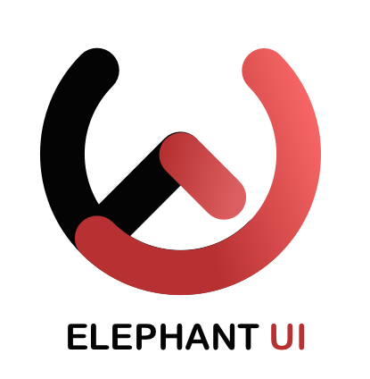

# EUI（Elephant UI）

[ ](https://travis-ci.com/jdthfe/eui) [ ](https://codecov.io/gh/jdthfe/eui/)  

`EUI` ( Elephant UI) 是一套使用 Typescript 和最新 React Hooks 语法开发的移动端组件库。

<p align="center">
  <a href="https://jdthfe.github.io/eui/" rel="nofollow">
    
  </a>
</p>

## 效果预览

-   [文档](https://jdthfe.github.io/eui/)

-   [移动端实例](https://jdthfe.github.io/eui/#/instance)

## 快速开发

安装依赖

yarn（推荐）

```bash
yarn install
```

npm

```bash
npm install
```

## 使用

-   [开发新组件](./docs/develop.md)
-   [使用组件库](https://jdthfe.github.io/eui/#/document/Introduce)

## 目录结构

[查看完整文件结构](./docs/docsMap.md)

```js
Project
│
├── src              //  组件源码
│   ├── _util            //  工具集
│   ├── [component]      //  单个组件
│   │   ├── __tests__    //  测试文件
│   │   ├── demo         //  用以展示的 demo
│   │   └── style        //  组件样式
│   └── style            //  样式
│
├── site             //  展示页源码
│   ├── _util            //  通用方法
│   ├── assets           //  静态资源
│   ├── document         //  文档页（用以电脑访问）
│   ├── instance         //  实例（用以手机访问）
│   └── style            //  样式
│
├── script           //  开发脚本
│   ├── config           //  webpack config
│   ├── gulp             //  gulp script
│   ├── template         //  组件模板
│   └── tests            //  测试相关
│
├── docs             //  项目文档
├── typings          //  类型文件
│                    //  下列文件夹需要运行对应脚本生成
├── build            //  yarn build，展示页打包代码
├── compiled         //  yarn prod，组件库打包代码
│   ├── dist             //  符合 umd 的代码
│   ├── es               //  符合 es6 模块化的代码
│   └── lib              //  符合 CommonJS 规范的模块化的代码
└── coverage         //  测试覆盖率
    ...
```

## 项目特性

-   UI 样式高度可配置，拓展性更强，轻松适应各类产品风格
-   提供 "组件按需加载" / "Web 页面高清显示" / "SVG Icon" 等优化方案，一体式开发
-   使用 TypeScript 开发，提供类型定义文件，支持类型及属性智能提示，方便业务开发
-   配合 TS 使用属性继承，方便对组件进行二次封装
-   使用 React Hooks 开发，性能优异
-   [测试覆盖率 80% 以上](https://codecov.io/gh/jdthfe/eui/)

## 0.0.3

-   新增了 Input 校验的触发方式
-   Radio 更新
